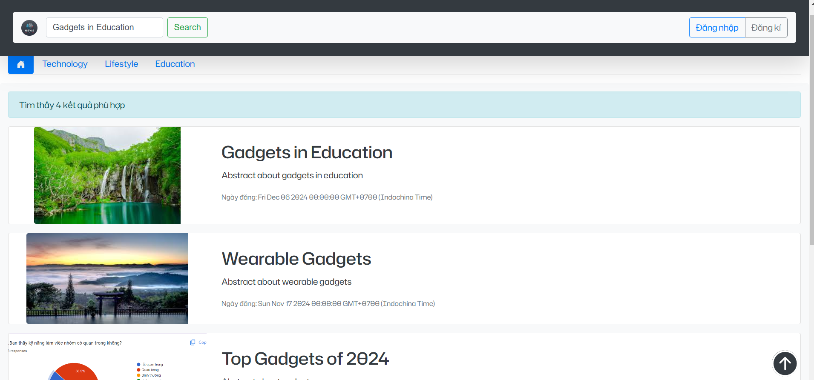
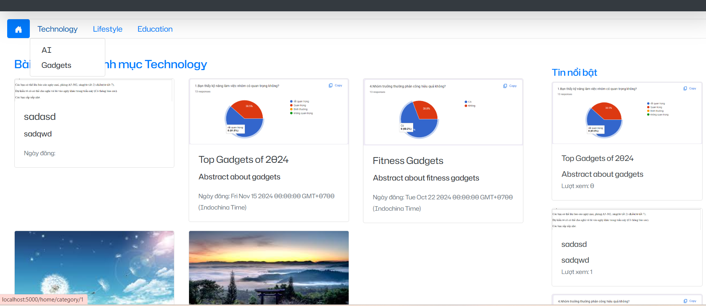
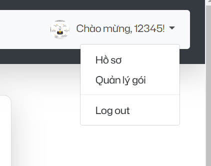

### **Mới đầu đăng ký bằng google do chưa có dữ liệu ở CSDL nên lỗi, nhưng nó có lưu trong CSDL rồi nên aem cứ quay về trang login và đăng nhập bằng google lần nữa là được**
**Cài các gói:**
npm i
### **folder database: lưu các file query thao tác với database: all_table(tạo các bảng cần thiết) ; add_admin(thay đổi vai trò user thành admin để vào được trang admin) ; sample(những dữ liệu mẫu để thêm vào các bảng)

### Chạy chương trình:
node app.js
npm run start
### Hướng dẫn chạy đồ án:
**cài đặt CSDL**
- Execute file database/all_table.sql: để thêm các bảng vào CSDL
- Execute file database/samples.sql: để insert các hàng vào từng bảng gồm: 3 user, 20 posts
- Execute file database/add_admin: nếu muốn thay đổi user nào đó thành role admin để tiện thao tác
**Truy cập web**
```sh
 http://localhost:5000/home
```
**Trang home(guest)**:
- tìm kiếm theo từ khóa fulltext (có phân trang)
<br>
- tìm bài theo chuyên mục: (có phân trang)
<br>
-tìm bài theo tag:(có phân trang) bấm xem chi tiết bài thì tag bài viết sẽ hiển thị dạng link khi bấm vào sẽ hiển thị các bài viết có tag đó

**Đăng ký/Đăng nhập**:
- Với form thường:
 có tích hợp dùng passportJS cho form thườngthường
 sau khi đăng ký xong thì đăng nhập theo role của tài khoản
- Với Google:
 có tích hợp dùng passportJS
 Mới đầu đăng ký bằng google do chưa có dữ liệu ở CSDL nên trả về trang yêu cầu đăng nhập lần nữa, nhưng nó có lưu lại nên khi lần tiếp theo thì sẽ được vô thẳng trang mình mong muốn luôn 
- Trường hợp quên mật khẩu:
 Có xác thực mã OTP gửi về mail để thay đổi mật khẩu
- Nhập tối thiểu 5 ký tự vì Có tích hợp validators để validate form nhập liệu

**Trang main(subscriber)**:
- Góc trên bên phải có các chức năng Hồ sơ(Profile cá nhân, có thể chỉnh sửa được) , quản lý gói(gói premium cho subscriber), Logout
<br>

**Trang admin**:
- phần quản lý chuyên mục: chuyên mục cha là: parent ID là NULL, editor ID là NULL ; và chuyên mục con là: parent ID là id của chuyên mục cha, editor ID là id của user editor mà muốn phân công cho
- danh sách người dùng: bấm vào button 'Xem' để hiện các thao tác CRUD với người dùng đó và nếu ai có role Subscriber thì sẽ có thêm button "Gia hạn"
- Quản lý bài viết: button "Xem chi tiết" để vừa xem và chỉnh sửa nếu muốn

